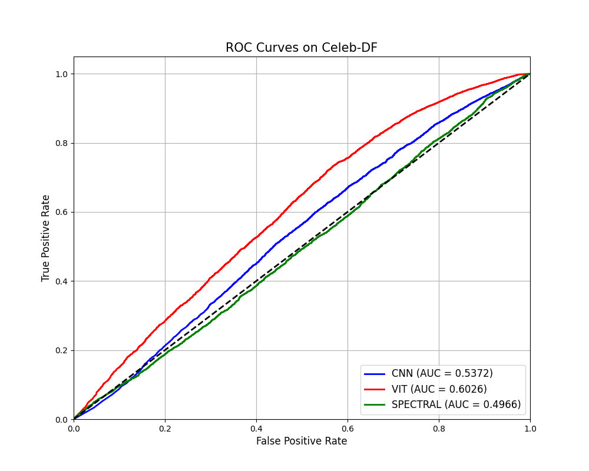
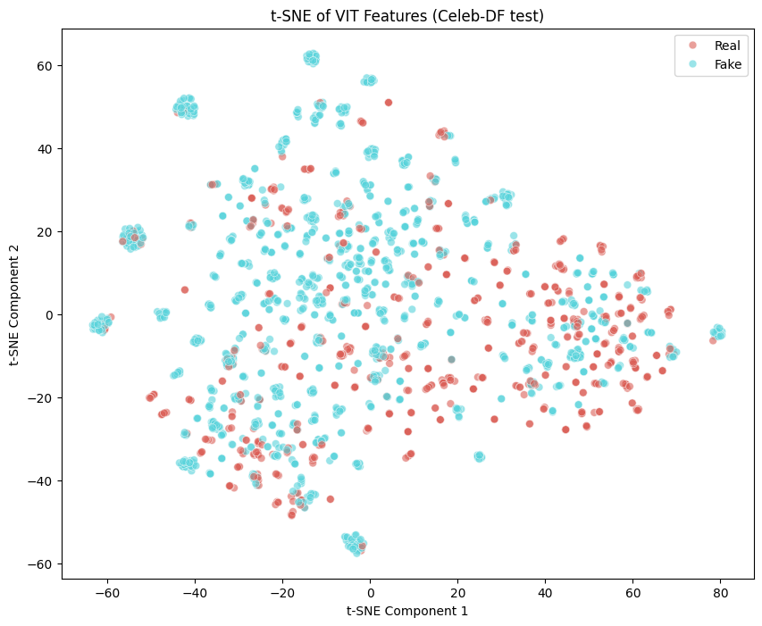

# Cross-Domain Deepfake Detection: Paradigm Comparison


Official implementation for the comparative analysis of spatial (CNN), contextual (ViT), and spectral (Frequency) paradigms for cross-domain deepfake detection. 

This repository provides a highly standardized, reproducible **Feature Extraction** pipeline to evaluate the true generalization capabilities of computer vision models when facing unseen generative algorithms, isolating the features from classifier-capacity biases.

---

## 📊 Experimental Results

Our experiments demonstrate that high Intra-domain accuracy (e.g., >0.95 AUC on FaceForensics++) is often an illusion caused by overfitting to local generator artifacts. When evaluated in a Cross-domain setting (Celeb-DF), models face severe degradation.

### Quantitative Metrics

| Architecture (Paradigm) | AUC (FF++) | F1 (FF++) | AUC (Celeb-DF) | F1 (Celeb-DF) | AUC Drop (Δ) |
| :--- | :---: | :---: | :---: | :---: | :---: |
| **CNN (EfficientNet-B4)** | 0.9561 | 0.9765 | 0.5372 | 0.7768 | 0.4189 |
| **ViT (ViT-Base/16)** | 0.9795 | 0.9765 | **0.6026** | 0.7954 | **0.3769** |
| **SPECTRAL (ResNet-18)** | 0.8916 | 0.9458 | 0.4966 | 0.7893 | 0.3949 |

*Vision Transformers (ViT) show the highest relative robustness by relying on global structural anomalies rather than local high-frequency blending artifacts.*

### Visualizations

<p align="center">
  
  
</p>
<p align="center">
  <em>Left: Cross-Domain ROC Curves (Celeb-DF). Right: t-SNE latent space projection of ViT features.</em>
</p>

---

## 📂 Dataset Preparation

Due to licensing agreements and extreme file sizes (several hundreds of Gigabytes), the raw video datasets **are not included** in this repository. You must download them manually from the official academic sources.

1. **FaceForensics++**: 
   * Fill out the request form on the [official FaceForensics GitHub](https://github.com/ondyari/FaceForensics).
   * Download the `c23` (H.264 compressed) version.
   * Extract the videos into the `FaceForensics++_C23/` folder in the project root.
2. **Celeb-DF (v2)**: 
   * Request access via the [official Celeb-DF repository](https://github.com/yuezunli/celeb-deepfakeforensics).
   * Extract the videos into the `Celed_df/` folder.

**Required Directory Structure:**
```text
CrossDomain-Deepfake-Detection/
├── FaceForensics++_C23/
│   ├── original_sequences/
│   └── manipulated_sequences/
├── Celed_df/
│   ├── Celeb-real/
│   └── Celeb-synthesis/
├── test_chek/             <-- Sample dataset (20 images) for quick testing
├── src/
└── ...
```

> **Note on `test_chek/`**: To help you quickly verify that the pipeline works without downloading the massive full datasets, we have included a small `test_chek/` folder. It contains 20 sample face images to demonstrate exactly how the extracted data should look before passing it to the feature extractors.

---

## 🛠️ Installation & Setup

1. **Clone the repository:**
   ```bash
   git clone https://github.com/CastleUp/CrossDomain-Deepfake-Detection.git
   cd CrossDomain-Deepfake-Detection
   ```

2. **Install dependencies:**
   ```bash
   pip install -r requirements.txt
   ```

3. **Install PyTorch with CUDA (Highly Recommended):**
   *To enable GPU acceleration for MTCNN and feature extractors (e.g., RTX 4050).*
   ```bash
   pip uninstall -y torch torchvision torchaudio
   pip install torch torchvision torchaudio --index-url https://download.pytorch.org/whl/cu121
   ```
   *Verify installation by running `python check_gpu.py`.*

---

## 🚀 Execution Pipeline

The pipeline is strictly modular. Execute the scripts sequentially:

1. **Data Preprocessing & Face Cropping:**
   *Extracts faces at 1 FPS using MTCNN with a 30% bounding box margin.*
   ```bash
   python src/data_prep/extract_faces.py
   ```

2. **Feature Extraction (Latent Space Isolation):**
   *Passes faces through frozen CNN, ViT, and Spectral backbones, caching `.pt` embeddings.*
   ```bash
   python src/features/cache_features.py
   ```

3. **Classifier Training:**
   *Trains the standardized MLP head on the extracted embeddings.*
   ```bash
   python src/train.py
   ```

4. **Evaluation & Visualization:**
   *Generates the ROC curves, AUC metrics, and populates the `evaluation_summary.csv`.*
   ```bash
   python src/evaluate.py
   ```

## ⚖️ License
This project is licensed under the [MIT License](LICENSE) - see the LICENSE file for details.
